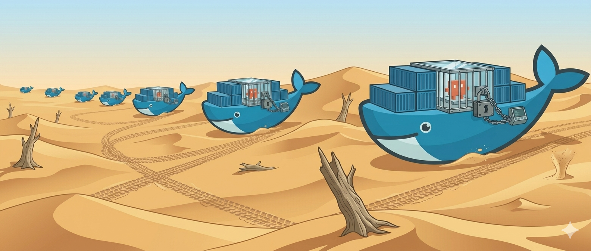

# Claude Code in Docker — Getting Started

This setup lets you run Claude Code inside a secure Docker container on the server. Claude can only access the directories you explicitly give it — nothing else on the filesystem is visible.

Each experiment lives in its own git repository. Scripts, Claude history, and custom skills are all version-controlled and backed up. Credentials are never committed.

**Prerequisites:** Docker and Docker Compose must be installed, and the `claude_sbl` image must already be available on this server (ask your admin if it isn't). A GitHub account and basic familiarity with version control are also assumed.



---

## Concept: one folder = one experiment = one git repo

> [!NOTE]
> In the following, replace:
> - `storm_user` with your STORM username
> - `exp_1` with the name of your experiment

The main idea is to have Claude working in an isolated environment so that the damage caused by any unwanted actions is limited as much as possible. Claude has no access to sensitive files like those in `.ssh` or anywhere else on the server.

To this end, for each experiment only three directories are mounted inside the container — and therefore visible to Claude:

- a **scripts** folder in read/write mode
- a **data** folder in read-only mode
- a **`.claude`** directory where history, skills, and other Claude-specific files are stored

Crucially, for security, you authenticate with Claude at the start of every session. Credentials are listed in `.gitignore` and are automatically deleted when the session ends, so they are never left on disk.

These three folders live inside a dedicated directory under `/home/storm_user/`, named after your experiment (e.g. `exp_1`).

> [!IMPORTANT]
> You should create a GitHub repo for each experiment folder. If the server is ever damaged or lost (including by Claude), you can restore all scripts and history up to the latest push with a simple `git clone`.

Here's the folder structure:

```
/home/users/storm_user/
├── exp_1/                     ← git repo for experiment 1
│   ├── .gitignore             ← excludes credentials only
│   ├── docker-compose.yml     ← edit the path to your data directory
│   ├── scripts/               ← your analysis scripts — tracked in git
│   └── claude_state/          ← Claude history & skills — tracked in git
│       └── .credentials.*     ← excluded by .gitignore, never committed
│
└── exp_2/                     ← git repo for experiment 2
    ├── .gitignore
    ├── docker-compose.yml
    ├── scripts/
    └── claude_state/
```

Everything inside the experiment folder (except credentials) is committed to git. If the server is lost, you recover with a `git clone`.

---

## One-time setup (per user)

### Export your UID and GID

Docker Compose needs `$UID` and `$GID` to run the container as your user. Add both to your shell config so they are always available:

```bash
echo 'export GID=$(id -g)' >> ~/.bashrc
echo 'export UID=$(id -u)' >> ~/.bashrc
source ~/.bashrc
```

> **Note for bash users:** `$UID` is a read-only built-in in bash, so the second line may print a harmless `readonly variable` warning. You can safely ignore it — bash already has the correct value.

---

## Setting up a new experiment

**WE WILL PROVIDE A VIDEO TUTORIAL FOR THIS**

### Step 0 — Create a new repo on GitHub

Go to [github.com](https://github.com) and log into your account. Create a new repository named after your experiment (e.g. `exp_1`). Make sure you have already registered a public SSH key from the server (STORM) in your GitHub account, as you will need it to push and pull.

### Step 1 — Create the experiment folder and initialise git

```bash
mkdir /home/users/storm_user/exp_1
cd /home/users/storm_user/exp_1
git init
```

### Step 2 — Copy the template files into the folder

Copy these two files from the template provided by your admin:

> [!IMPORTANT]
> `.gitignore` is a hidden file (all files starting with `.` are hidden) and is not visible with a plain `ls`. Always use `ls -lha` in the terminal — avoid GUI file managers for this setup.

```
.gitignore
docker-compose.yml
```

Then create the scripts directory:

```bash
mkdir scripts
```

The `claude_state/` directory is created automatically the first time you run the container.

### Step 3 — Edit the one placeholder in `docker-compose.yml`

Open `docker-compose.yml` and change the data volume path — scripts and `claude_state` use relative paths and are already correct:

```yaml
# ⚠️  Edit this line only:
- /path/to/your/data/directory/:/workspace/data:ro
```

For example:

```yaml
- /data00/storm_user/exp_1/data_work:/workspace/data:ro
```

Save the file.

### Step 4 — Connect to GitHub and make the first commit

```bash
git add .gitignore docker-compose.yml scripts/
git commit -m "init exp_1 experiment"
git remote add origin git@github.com:[github_username]/exp_1.git
git push -u origin main
```

---

## Starting a Claude session

From the experiment folder:

```bash
cd /home/users/storm_user/exp_1
docker compose run --rm claude_sbl
```

That's it. Claude Code starts with access to your scripts and data for this experiment.

**Every session:** Claude Code will display a login URL. Open it in your browser, log in with your Anthropic account, and the session starts. *(Login is required each session — credentials are intentionally not saved between sessions.)*

---

## What Claude can and cannot do

| Location | Claude's access |
|---|---|
| `/workspace/scripts/` | ✅ Read and write — Claude edits your scripts here |
| `/workspace/data/` | 👁️ Read only — cannot modify or delete data |
| Everything else on the server | 🚫 Not visible — completely outside the container |

---

## Committing after a session

After working with Claude, commit from your host terminal (not from inside Claude):

```bash
cd /home/users/storm_user/exp_1
git add -A
git commit -m "session: describe what was done"
git push
```

This captures both new/modified scripts and any updates to Claude's history and skills. Credentials are automatically excluded by `.gitignore`.

> **Note:** Git is not installed inside the container — Claude cannot run `git push` during a session. All git operations happen from your host terminal.

---

## Experiment isolation

Each experiment folder is a completely independent git repo. Claude working on `exp_1` has no access to `exp_2` data, scripts, or history — and vice versa.

If you want to share a custom command ("skill") between experiments, copy the relevant file from one `claude_state/commands/` directory to another on the host.

---

## Frequently asked questions

**Can Claude delete my data?**
No. The data volume is mounted read-only (`:ro`). Any write or delete attempt is rejected by the kernel.

**Can Claude push credentials to GitHub?**
No — for two reasons: (1) git is not installed inside the container, so Claude cannot run any git commands; (2) even if you run git from the host, the `.gitignore` excludes all known credential file names.

**Can Claude access files outside my scripts and data directories?**
No. Docker isolation ensures only the paths listed in `docker-compose.yml` are visible inside the container.

**What is `claude_state/`?**
Claude's working memory for this experiment: conversation history, custom commands, and settings. It is committed to git (minus credentials) so it survives a server failure. Delete it if you want a completely fresh start for this experiment.

**Why do I need to log in every session?**
Credentials are intentionally not saved between sessions for security. Your history and custom commands are preserved in `claude_state/` and committed to git — only the authentication token is discarded.

**Files I created during a session are owned by a strange user — why?**
This should not happen with this setup. The container runs as your own UID/GID, so files written to `scripts/` are owned by you on the host, just like any file you create directly.
